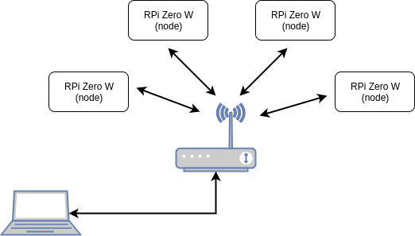
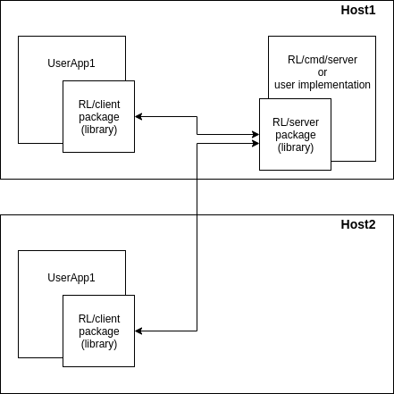

# RemLog - remote logging service

This project provides Go package for logs sending (client side) and standalone application for logs collection (server side).

## Introduction

The purpose of this project is to provide simple way of remote logs collection. The idea is to have multiple applications, potentialy launched on different hosts, and one single point of logs saving.

Sample usage scenario can be group of sensor nodes (ex. set of RPi Zero W boards) and a laptop as a monitoring device shown on picture below.

Provided Go sources contains client side package, server side package (for custom server implementation) and sample server implementation for out-of-a-box log collection. All of that allow to set up environment as on picture below.

## Installation and usage

### Client side and server side packages

### Sample log collection server

## License
